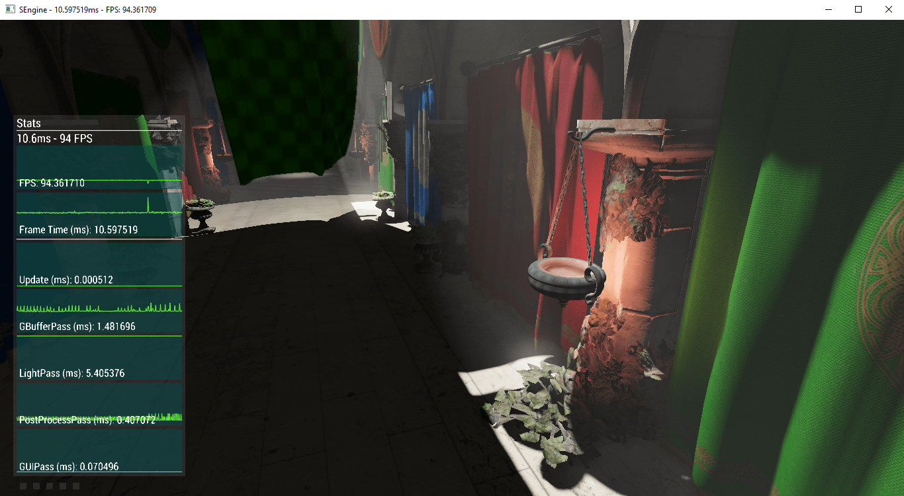
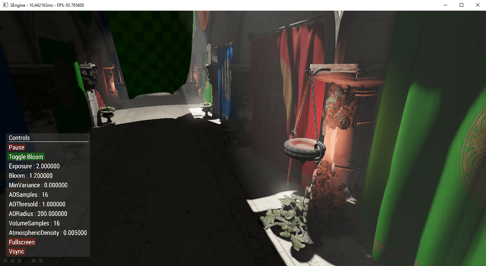

# Basic GUI

GUI system I used in my OpenGL examples [here](https://github.com/Senryoku/SEngine) before replacing it by [dear imgui](https://github.com/ocornut/imgui).
This is totally useless, but I wanted it to have its own repository as I like some parts of the design (even if the whole system is fairly limited).

It's a basic retained GUI system, "widgets" are derived from a basic class named GUIElement.
Text is displayed using font SDF (signed distance function) generated with SDFont (https://github.com/VDrift/sdfont).

# Dependencies

[GLM](http://glm.g-truc.net) (Only for the vec2 class I think ?...)

[SenOGL](https://github.com/Senryoku/SenOGL) (Wrapping some OpenGL calls)

You'll also need something to manage the opengl programs/shaders, like the Resources module of [this](https://github.com/Senryoku/SEngine) (this is currently in use in this version, see the Resources::getProgram or Resources::load calls).

# Examples

